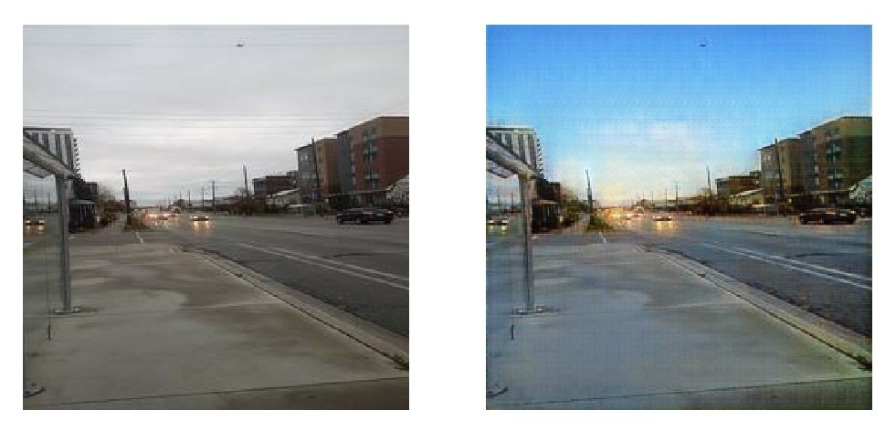
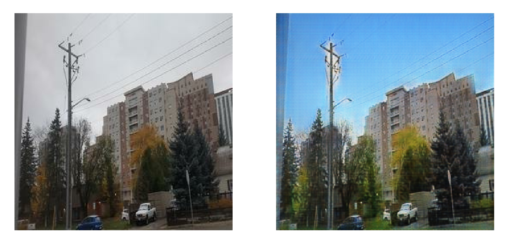
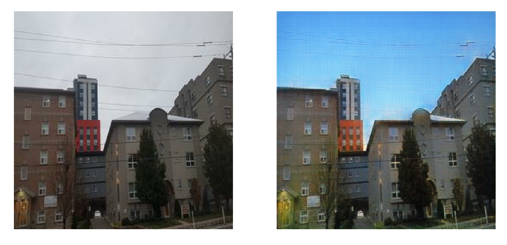

Turn a cloudy picture into a SUNNY one!!!
A CycleGAN model to enable training with unpaired data.

# How it works
CycleGAN is built on the techniques used in General Adversarial Networks, the model consists of 2 generators (G and F) and 2 discriminators (D_X and D_Y).

G generates from X to Y (X -> Y), while F generates from Y to X (Y -> X).

D_X picks between X (a “real” X) and F(Y) (an X “generated” by generator F), while D_Y does this for Y (a “real” Y) and G(X) (a Y “generated” by generator G)

We can train/improve the discriminators by labelling the “real” and “generated” X’s and Y’s. Then, use the results from the discriminators to improve the generators.

The model is also improved using cycle consistency loss:

Generator G takes in X and outputs G(X) = Y, which is then fed into generator F which outputs F(G(X)) = X’. This X’ is compared with the original X to minimize the difference. This comparison also happens between G(F(Y)) = Y’ and the original Y.

<h3>
  <i>Forward cycle consistency loss: X -> G(X) -> F(G(X) -> X'</i>
</h3>

<h3>
  <i>Backward cycle consistency loss: Y -> F(Y) -> G(F(Y) -> Y'</i>
</h3>

# Download the trained model
You can <a href="https://drive.google.com/open?id=1YxaG1aUWy2EGobZ_V_FWJ1OOB2WbHE_-">download the trained model here</a> 

You can load it using tf.saved_model.load(): https://www.tensorflow.org/api_docs/python/tf/saved_model/load

# Get the untrained model
You can take the untrained model and use it to train on a different dataset to produce your own image translator. For the untrained model, checkout 

# Results
Results using images taken from my own camera:
Input vs Output

